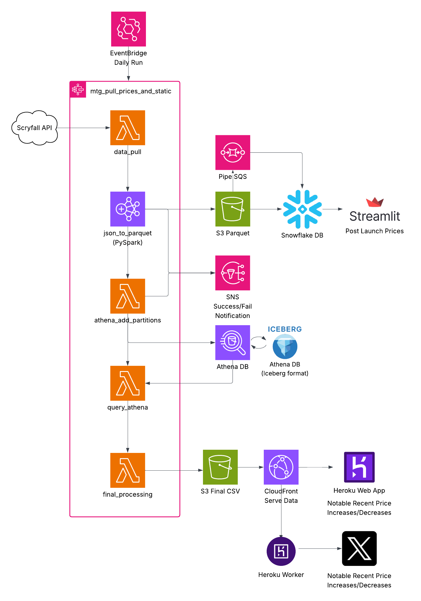
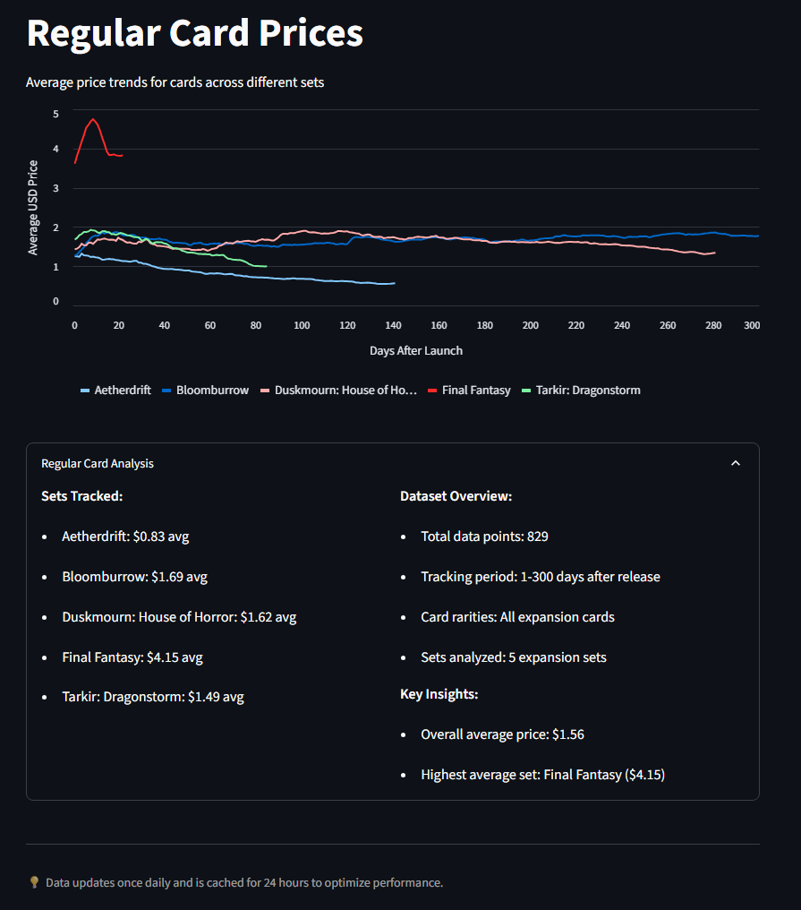

# MTG Price Tracking Pipeline

*End-to-end data pipeline architecture processing 90K+ records daily*

*Daily price tracking dashboard showing normalized trends across MTG sets*

## Project Description
Be able to discover long-term trends in all Magic: The Gathering cards. Especially in terms of card price over time. All tasks are fully end-to-end automated.

## Impact
- Processes 90K+ card records daily
- Tracks 30M+ price data points across >1 year of historical data
- Delivers insights via web dashboard, mobile app, and automated social media

## Solution - Why did I build it?

### Education
I wanted to build an end-to-end data pipeline on a topic I found to be interesting. In particular, I wanted the pipeline to be fully automated. I wake up to refreshed visualizations and status updates into my email.

### Insight
This aggregation of data does replicate some insights that can be found elsewhere (TCGplayer is a great example), but also gives me the flexibility to visualize the data on demand in interesting ways I have not found to be available elsewhere, such as prices normalized to each set's respective release date. The Final Fantasy set in particular has been very exciting to track every day, as it has been an extreme outlier compared to the sets that came before it.

## Key Technologies
- AWS
  - Lambda
  - Step Functions
  - EventBridge
  - Athena
  - S3
  - EMR Serverless
  - PySpark
  - CloudFront
  - SNS
  - SQS
- Snowflake
  - Pipes
  - Tasks
  - Stages
  - Functions
  - Procedures
- Streamlit
- Apache Iceberg
- Flask
- Heroku

## Architecture

### AWS

#### Daily pipeline
- Daily at 4am PST, kick off a step function which runs a series of lambdas and EMR Serverless, prompted by an EventBridge schedule.
- **Lambda: Pull JSON Data** - Tap into the Scryfall API for daily bulk card data, including current prices.
- **EMR Serverless: Convert JSON to Parquet** - Pare down the full dataset down to choice fields per card.
  - 2 Parquet are created. 1 for daily prices and 1 for static values like name and set.
  - SNS notification on success/fail
- **Lambda: Add Athena Partitions** - Add the new data to my iceberg table, ensuring no duplicates will be inserted. Another SNS message is sent.
  - Apache Iceberg format is used for my price table. I used iceberg as an educational opportunity. Day to day I could get away with my standard table, which is still driven by parquet files.
- **Lambda Query Athena** - Now that Athena has the newest data, run my query against the tables, store the partially processed data.
  - The data store of 1 file per day was designed to work efficiently with this query, which only needs to access 4 specific days of data. Today and 1, 2, 4 weeks ago.
  - Horizontal slice queries, 1 card for all dates, are handled in Snowflake, as they would be highly inefficient and expensive in Athena.
- **Lambda Final Data Processing** - Take the stored data and run some more complex transforms.
  - In theory, these transforms could have all been done in SQL. I found it more accessible to use python for part of the transform process.

#### CloudFront
- Serves the final processed data CSV to my Heroku instance. The CSV is replaced daily into the same location.

#### S3 Replication Rules
Despite the event of data loss being unlikely, the damage of data loss would be catastrophic to my project. For this reason, I incur a small expense to copy the daily and weekly critical files from my main us-west-2 (Oregon) bucket to a purely backup us-west-1 (N. California) bucket. During the copy, I transition the storage class to Standard-IA. In time, it may make sense to use Glacier, but my backup costs are currently $0.03 per month, which I'm ok with taking the hit on.

### Snowflake
- **Stages** - Price and static parquet data are staged into Snowflake via my S3.
- **Pipe** - SQS is leveraged to notify Snowflake when new data are available. The new parquet immediately loads into my Snowflake table.
- **Procedure** - My static card data are loaded into Snowflake via procedure due to the complex nature of the process. It runs an upsert while ensuring newer data are maintained if older data were ever to reinsert. I have found that even a truncate and insert would not be effective because the occasional card data are lost to the weekly "full" data.
- **Task** - The weekly static data procedure is kicked off by a cron task every Friday 5AM PST.

### Frontend

#### Streamlit - https://mtg-price-dashboard.streamlit.app
- Dashboard repo: https://github.com/applewjr/mtg-price-dashboard
- My first of 3 frontend visualizations. Here, I present a dashboard of interesting graphs centering around card prices per set, normalized to before and after release date.
- Source data are fully driven by Snowflake.
- This frontend was originally designed to give the end user the ability to see the price history for any card. I have removed this option since it is an expensive feature to put into the hands of the open internet. The dashboard I have left in place is static and can be cached for 24 hours without being out of date. This leads to a maximum of 60 seconds of compute per day against Snowflake.

#### Heroku App - https://www.jamesapplewhite.com/mtg
- Flask app repo: https://github.com/applewjr/heroku_apps
- Receives the data served by CloudFront, parses the outlier rows, and presents the top and bottom 10 price increases and decreases.

#### Twitter (X) Bot - https://x.com/J_R_Applewhite
- Posting script: https://github.com/applewjr/heroku_apps/blob/main/scheduled_tasks_mtg/mtg_prices.py
- Each morning, a Heroku worker receives the data served by CloudFront, pulls out the top and bottom 3 outlier cards for the day, and tweets about the card.

## Other Notes/Insights

### Snowflake Performance
Snowflake's data compression is amazing to see. I leaned into Snowflake because the platform had a lot of love and I see why. As of this writing, 1.1GB of parquet data across 347 days compressed to 103MB for 29.6M rows of price data. Snowflake was designed for the horizontal look at data, 1 card across all dates. I have found it to be suitable for all use cases. I continue to use Athena for vertical slice queries (all cards for a few dates) since Snowflake is more expensive ($0.033 per query due to the minimum 60 second compute time. My queries really run in 1-3 seconds).

### Data Recovery Strategy
Given the little tolerance for a lost day of data, my failsafe is to disable my S3 lifecycle rule which deletes the raw JSON data after 1 day. This allows me to troubleshoot any issues without threat of data loss. This has happened once before when a lambda shot up in processing time, leading to 15 minute timeouts. I retained raw data for a few days while I implemented Python's ijson package to convert JSON to CSV in a more memory efficient manner. All functions also use a standard get_dates() function which allows me to plug in a historic date for older data processing.

### Technology Pivot: Lambda to EMR Serverless
The lambda timeout on JSON to Parquet was a solid warning to me that lambdas aren't meant to parse big JSON docs. My implementation of ijson was a temporary fix at best. I have since shifted the JSON parsing to EMR Serverless/PySpark. This is more costly by a few cents per day, but this method is going to scale over time as the number of Magic cards continually increases. I also used this opportunity to do away with my intermediate CSV conversion step.

### Technology Pivot: DynamoDB to Athena
I originally aimed to use DynamoDB instead of Athena. I made this decision because NoSQL databases seemed new and cool. After getting my ingestion pipeline running, I realized the cost of data inserts was ~$0.1 per day, which was more than I anticipated. I could decrease the cost by inserting records more slowly, but I then hit lambda max time limitations. Even worse, I realized the downstream querying of data could be catastrophically expensive. For this reason, I shifted to a good old fashioned relational database like Athena. My Athena query costs do not even register $0.01 of expense per month and my S3 GET requests cost $0.01 per month, particularly due to my daily file storage strategy.

## Future Enhancements

### Enhanced Static Data
Over time, I have learned to appreciate the depth of static information available in the Scryfall API and its value to highly flexible data analysis. My current static table contains 14 columns. I have mapped ~100 columns that should be included in my static table. The processing increase will be minimal as I already receive, then reject, the additional fields. The data store increase will be minimal as I upsert weekly and do not have to retain older duplicate records. I have inserted an ad hoc mock up table into Snowflake and have first hand experience getting to enjoy the depth of information available.

### Pipeline Optimization
The intermediate step of CSV conversion was a safety net while I got my footing in parquet style formats. This is now an artifact and could be done away with, shifting to direct JSON to parquet conversion.

### Data Source Resilience
I have been burned by APIs that choose to limit their data availability (Thanks, Spotify). Scryfall has been a 100% reliable daily data source so far, but that is not a guarantee forever. I must find an alternate data source that I could cut over to should Scryfall revise their offering or cease to exist. mtgjson.com appears to be a promising source, however both mtgjson and Scryfall rely on TCGplayer.

## Live Demos

### 📊 [Streamlit Dashboard](https://mtg-price-dashboard.streamlit.app/)
Interactive price analytics dashboard with set-normalized trend analysis

### 🌐 [Daily Price Tracker](https://www.jamesapplewhite.com/mtg)
Real-time top/bottom price movers updated daily via CloudFront

### 🐦 [Twitter Bot](https://x.com/J_R_Applewhite)
Automated daily tweets highlighting notable price changes